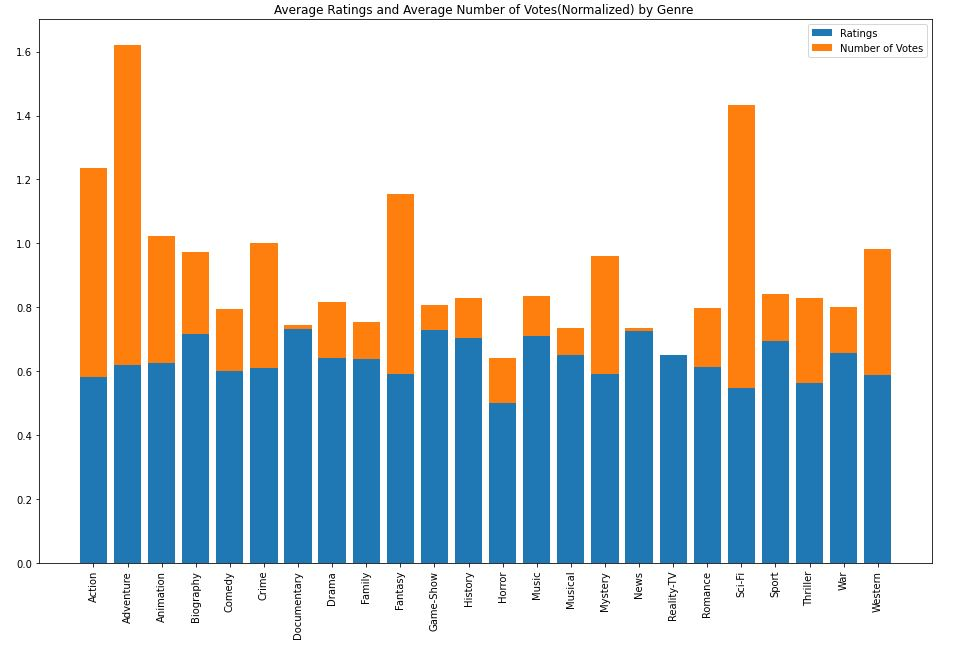
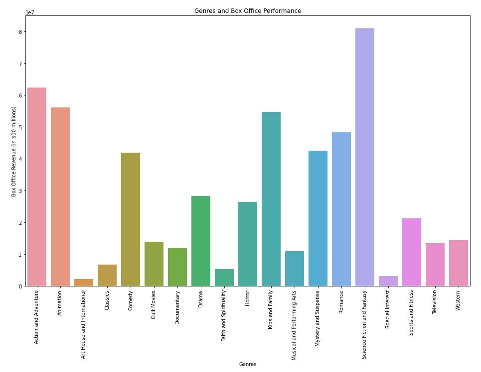
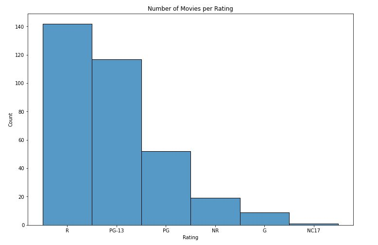
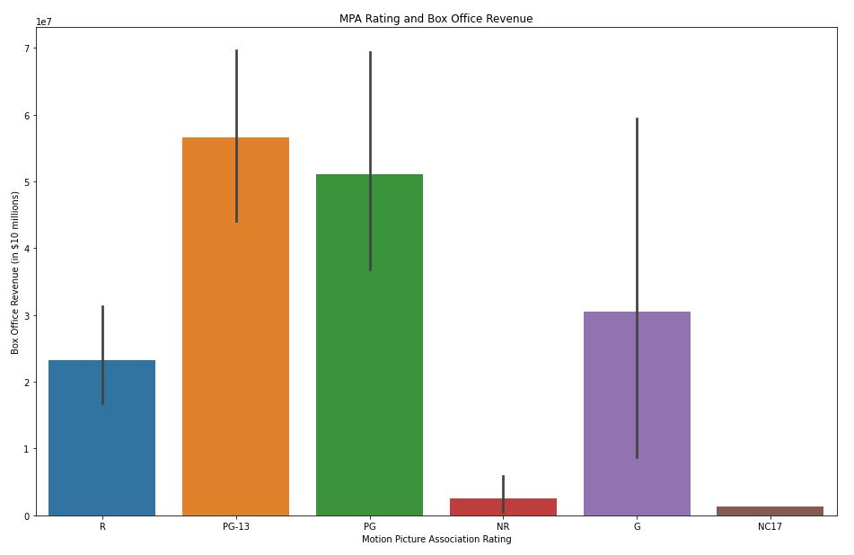

# Project 1: Microsoft's Entry to the Film Industry

* Sam Lim
* Full Time Online
* Victor Geislinger

## Overview

This project aims to analyze the types of movies that generates the most revenue. Factors such as the movie's ratings (PG, G, PG-13, etc.), number of votes for scores it received, as well as the average of the users' scores by genres were used to help determine which type(s) of movies Microsoft should create.  

## Business Problem

Microsoft does not have prior experience in the film industry, and needs to minimize the risk of entering a new industry. However, there are numerous genres of movies as well as the budgeting problem. This project aims to aid Microsoft by providing datas related to these problems.

## Data

Using databases from movie review websites such as Rotten Tomatoes, IMDB, and The Movie Database, this project was able to assess different movie genres' and ratings' (PG, PG-13, etc.) popularity, as well as how each genre did in the box office. For movies that had multiple genres, each of its genre were given same ratings, number of votes, as well as box office profits. 

## Methods

This project uses descriptive analysis to find relations between the movies' genres and earnings as well as relationship between the budget and gross revenue.

## Results

Since it can be assumed that the movies with the most number of user rating votes are the most popular to the general public, movies with genres such as Adventure, Sci-Fi, and Action received the most attention.

In terms of box office revenues, the Science Fiction and Fantasy genre performed the best, followed by Action and Adventure, Animation, and Kids and Family. However, the overwhelming revenue in the Science Fiction and Fantasy genre can be attributed to popular franchises such as the Marvel series, the Starwars series, and the Avatar. These franchises have been able to outperform most of its competitors through their prolonged presence in the industry(Marvel/Starwars) and innovative features such as 3D movie experience(Avatar). 

As for the relationship between Motion Picture Association's ratings and the movie's overall performance, data shows that PG-13 movies offer the most value. The first graph shows the number of movies per MPA rating, and the second graph shows the average box office revenue per MPA rating. PG-13 movies on average earned more box office revenue compared to the PG rated movies. While the second graph shows that some PG movies did as well as the highest earning PG-13 movies, it also shows that the range of earnings fluctuates more in the PG movies. 

Though there is a slight positive correlation between the budget and the world wide gross revenue, the range of revenue of movies with similar budgets were as large as nearly $2 billion. Therefore, this anlysis cannot recommend Microsoft an advisable budget range.

## Conclusions

This data analysis recommends the followings for Microsoft's entry to the movie industry while minimizing the risk of monetary losses:

 - **Recommended Genres:** Action and Adventure, Kids and Family/Animation, Sci-Fi and Fantasy, and Romance genres performed the best in the box office. Although Sci-fi and Fantasy had many popular movie franchises that boosted its overall box office revenue; however, data seems to show general public has interest in this genre. Action and Adventure is a more approachable genre that was able to generate the second most box office revenue. This analysis coupled the Kids and Family genre with the Animation genre as most of these movies had both of these genres.
 
 - **Recommended MPA Rating:** According to the datasets used in this analysis, movies that were rated PG and PG-13 were able to generate the most box office revenue. Movies rated PG-13 were able to generate the most box office revenue of around $60 million on average followed by PG movies which earned slightly less than $50 million on average.
 
 - **Genres to Avoid:** Unless Microsoft is dedicated to pure cinematography, it should avoid the Art House and International genre. Other genres such as Faith and Spirituality, Classics, and Musical and Performing Arts also performed poorly in terms of box office revenue.
 
 - **MPA Ratings to Avoid:** Movies rated R, NR, or NC17 performed poorly in the box office. It can be assumed this is because many movie goers include children. Creating G rated movies is also not recommended as the range of box office earnings is the greatest of all MPA ratings. 
 
### Next Steps

Further analysis of the data including popular actors and directors could yet decrease the risk of entering the movie industry further:

 - **Some favorite/popular actresses/actors and/or directors could help boost public's interest in a movie:** Many actresses/actors as well as directors have built a reputation of creating enjoyable movies. Collecting data about individual actresses/actors and directors may help deduce the types of movies that Microsoft should create.

 - **Streaming services may outperform movie theaters and maybe a better indicator of a movie's performance:** As COVID-19 has influenced majority of the world's daily lives, including those of movie goers, streaming services have taken a more dominant role for movie enthusiasts. Microsoft may need to look more into the data collected from such streaming services in order to get a better representation of the public's movie preferences.
 
 - **Movie budgeting needs more insights:** As mentioned before, movies had a variety of budgeting as well as a variety of global gross revenue. Microsoft may need more data on how these budgets were spent on movies that outperformed its counter-parts with similar budgets.
 
 ## For More Info
 
 Full analysis is available in the [Jupyter Notebook](Microsoft_Popular_Movie_Genres_Analysis.ipynb) or through this [presentation](DS_Project_1_Sam_Lim.pdf).
 
 For additional information, contact Sam Lim at yslim700@gmail.com